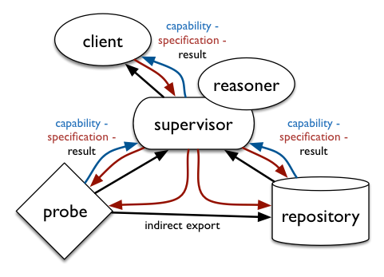

# mPlane Protocol Specification

- - -
__ed. Brian Trammell <trammell@tik.ee.ethz.ch>, revision in progress of 8 May 2014__
- - -

This section defines the present revision of the mPlane architecture for
coordination of heterogeneous network measurement components: probes and
repositories that measure, analyze, and store aspects of the network. The
architecture is defined in terms of a single protocol, described in this
document, used between __clients__ (which request measurements and analyses)
and __components__ (which perform them). 

Sets of components are organized
into measurement infrastructures by association with a __supervisor__, which
acts as both a client (to the components it supervises) and a component (to the
clients it serves), and provides application-specific decomposition of specifications and composition of results. This arrangement is shown below, 
and further described in the rest of the document. The _capability - specification - result_ cycle in this diagram comprises the mPlane protocol.



This document borrows heavily from mPlane project [Deliverable 1.3](https://www.ict-mplane.eu/sites/default/files//public/public-page/public-deliverables//697mplane-d13.pdf), of 31 October 2013, by B. Trammell, M. Mellia, A. Finamore, S. Traverso, T. Szemethy, B. Szabó, R. Winter, M. Faath, D. Rossi, B. Donnet, F. Invernizzi, and D. Papadimitriou. Updates to the present state of the mPlane protocol are in progress.

## mPlane Architecture

### Principles

First, considering the wide variety of measurement tools we'd like to integrate into mPlane, we realised relatively early that distinctions among types of tools at an architectural level are somewhat artificial. The set capabilities that advertise what a tool can do define what that tool is. Therefore, _anything_ that publishes capabilities and makes services available according to them using the protocol described in this document is a __component__ and _anything_ that uses those capabilities is a __client__.

Given the heterogeneity of the measurement tools and techniques applied, and the heterogeneity of component management, especially in large-scale measurement infrastructures, reliably stateful management and control would imply significant overhead at the supervisors and/or significant measurement control overhead on the wire to maintain connectivity among components and to resynchronize the system after a partial disconnection event or component failure.

A second architectural principle is therefore __state distribution__: by
explicitly acknowledging that each control interaction is best-effort in any
case, and keeping explicit information about each measurement in all messages
relevant to that measurement, the state of the measurements is in effect
distributed among all components, and resynchronization happens implicitly as
part of message exchange. The failure of a component during a large scale
measurement can therefore be accounted for after the fact. Concretely, this implies that each capability, specification, and result must contain enough information to intepret in isolation.

This emphasis on distributed state and heterogeneity, along with the
flexibility of the representations and session protocols used with the
platform, makes the mPlane protocol applicable to a wide range of scales,
from resource- and connectivity-limited probes such as smartphones and
customer-premises equipment (CPE) like home routers up to large-scale backbone
measurement devices and repositories backed by database and compute clusters.

mPlane defines a self-describing, error- and delay-tolerant remote
procedure call protocol: each capability exposes an entry point in the API
provided by the component; each statement embodies an API call; and each result
returns the results of an API call. The final key principle in the mPlane
architecture, which allows it to be applied to the problem of heterogeneous
measurement interoperability, is __type primacy__. A measurement is
completely described by the type of data it produces, in terms of schemas
composed of elements. The key to measurement interoperability in mPlane is
therefore the definition of a type __registry__.

### Components and Clients

### Supervisors and Federation

## Protocol Information Model: Type Registry

The type registry makes up the vocabulary by which mPlane components and clients can express the meaning of parameters, metadata, and result columns for mPlane statements. The registry is formatted as a JSON object with the following keys:

- __registry-format__: currently `"mplane-0"`, determines the revision of the registry format.
- __registry-uri__: the URI identifying the registry. The URI must be dereferenceable to retrieve the canonical version of this registry
- __registry-revision__: a serial number starting with 0 and incremented with each revision, 
- __includes__: a list of URLs to retrieve additional registries from. Included registries will be evaluated in depth-first order. Elements with identical names will be replaced by registries parsed later.
- __elements__: a list of objects, each of which has the following three keys:
    - __name__: The name of the element
    - __prim__: The primitive type of the element, from the list of primitives
    - __desc__: An English-language description of the meaning of the element.

An example registry with two elements and no includes follows:

```
{ "registry-format": "mplane-0",
  "registry-uri", "http://ict-mplane.eu/registry/0",
  "registry-revision": 0,
  "includes": [],
  "elements": [
      { "name": "full.structured.name",
        "prim": "string",
        "desc": "A representation of foo..."
      },
      { "name": "another.structured.name",
        "prim": "string",
        "desc": "A representation of bar..."
      },
  ]
}
```

We anticipate an `"mplane-1"` revision of the registry format which directly supports simpler expression of structured names, but development of this is ongoing.

__Fully qualified__ element names consist of the element's name as an anchor after the URI from which the element came, e.g. `http://ict-mplane.eu/registry/0#full.structured.name`.

## Protocol Information Model: Message Types

### Capabilities

### Specifications

### Results

### Receipts and Redemptions

### Indirections (not yet implemented)

## Protocol Information Model: Message Sections

### Type and Verb

### Temporal Scope (When)

A temporal scope refers to when a measurement can be run (in a Capability), when it should be run (in a Specification), or when it was run (in a Result). Temporal scopes can be either absolute or relative, and may have an optional period. They are built from ISO8601 timestamps (for absolute times), duration specifiers, and the special times ```past```, ```now```, and ```future```.

The general form of a temporal scope (in BNF-like syntax) is as follows:

```
when = <singleton> |            # A single point in time
       <range> |                # A range between two points in time
       <range> ' / ' <duration> # A range with a period

singleton = <iso8601> | # absolute singleton
            'now'       # relative singleton

range = <iso8601> ' ... ' <iso8601> | # absolute range
        <iso8601> ' + ' <duration> |  # relative range
        'now' ' ... ' <iso8061> |     # definite future
        'now' ' + ' <duration> |      # relative future
        <iso8601> ' ... ' 'now' |     # definite past
        'past ... now' |              # indefinite past
        'now ... future' |            # indefinite future
        <iso8601> ' ... ' 'future' |  # absolute indefinite future
        'past ... future' |           # forever

duration = [ <n> 'd' ] # days
           [ <n> 'h' ] # hours
           [ <n> 'm' ] # minute
           [ <n> 's' ] # seconds 

iso8601 = <n> '-' <n> '-' <n> [' ' <n> ':' <n> ':' <n> [ '.' <n> ]
```

All absolute times are __always__ given in UTC.

In Capabilities, if a period is given it represents the _minumum_ period supported by the measurement; this is done to allow large-granularity rate limiting. If no period is given, the measurement is not periodic. Capabilities with periods can only be fulfilled by Specifications with periods.

Only absolute range temporal scopes are allowed for Results.

So, for example, an absolute range in time might be expressed as: ```when: 2009-02-20 13:02:15 ... 2014-04-04 04:27:19```. A relative range covering three and a half days might be ```when: 2009-04-04 04:00:00 + 3d12h```. In a Specification for running an immediate measurement for three hours every seven and a half minutes: ```when: now + 3h / 7m30s```. In a Capability noting that a Repository can answer questions about the past: ```when: past ... now```. In a Specification requesting that a measurement run from a specified point in time until interrupted: ```when: 2017-11-23 18:30:00 ... future```. 

### Schedule

### Parameters

### Result Columns

### Metadata

### Export

### Link

### Label

### Token

### Version

## Session Protocols

### JSON representation

### mPlane over HTTPS

### mPlane over SSH

## Workflows in mPlane

### Component Push

### Component Pull