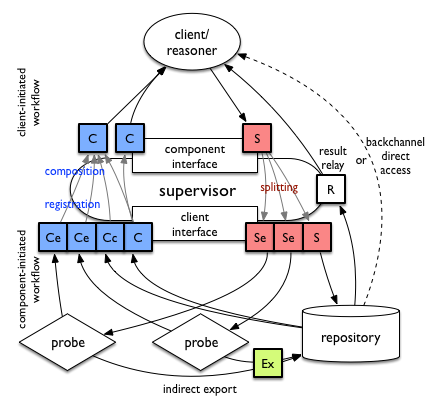

# mPlane Protocol Specification

- - -
__ed. Brian Trammell <trammell@tik.ee.ethz.ch>, as submitted as mPlane Deliverable 1.4, 31 October 2014__
- - -

This document defines the present revision of the mPlane architecture for
coordination of heterogeneous network measurement components: probes and
repositories that measure, analyze, and store network measurements,
data derived from measurements, and other ancillary data about elements
of the network. The architecture is defined in terms of a single protocol, 
described in this document, used between __clients__ (which request 
measurements and analyses) and __components__ (which perform them). 

Sets of components are organized
into measurement infrastructures by association with a __supervisor__, which
acts as both a client (to the components it supervises) and a component (to the
clients it serves), and provides application-specific decomposition of specifications and composition of results. This arrangement is shown below, 
and further described in the rest of the document. The _capability - specification - result_ cycle in this diagram comprises the mPlane protocol.


This document is the work of the mPlane consortium, specifically B. Trammell, M. Kühlewind, M. Mellia, A. Finamore, S. Pentassuglia, G. De Rosa, F. Invernizzi, M. Milanesio, D. Rossi, S. Niccolini, I. Leontiadis, T. Szemethy, B. Szabó, R. Winter, M. Faath, B. Donnet, and D. Papadimitriou. It reflects Version 1 of the mPlane protocol.

# mPlane Architecture

## Principles

First, considering the wide variety of measurement tools we'd like to 
integrate into the mPlane platform, we realized relatively early that distinctions 
among types of tools at an architectural level are somewhat artificial. The set of
capabilities that advertise what a tool can do define what that tool is. Therefore, 
_anything_ that publishes capabilities and makes services available according to 
them using the protocol described in this document is a __component__ and _anything_ 
that uses those capabilities is a __client__.

Given the heterogeneity of the measurement tools and techniques applied, and the
heterogeneity of component management, especially in large-scale measurement 
infrastructures, reliably stateful management and control would imply 
significant overhead at the supervisors and/or significant measurement control 
overhead on the wire to maintain connectivity among components and to resynchronize 
the system after a partial disconnection event or component failure.

A second architectural principle is therefore __state distribution__: by
explicitly acknowledging that each control interaction is best-effort in any
case, and keeping explicit information about each measurement in all messages
relevant to that measurement, the state of the measurements is in effect
distributed among all components, and resynchronization happens implicitly as
part of message exchange. The failure of a component during a large scale
measurement can therefore be detected and corrected afterwards. Concretely, this 
implies that each capability, specification, and result must contain enough 
information to intepret in isolation.

This emphasis on distributed state and heterogeneity, along with the
flexibility of the representation and session protocol used by the
platform, makes the mPlane protocol applicable to a wide range of scales,
from resource- and connectivity-limited probes such as smartphones and
customer-premises equipment (CPE) like home routers up to large-scale backbone
measurement devices and repositories backed by database and compute clusters.

mPlane defines a self-describing, error- and delay-tolerant remote
procedure call protocol: each __capability__ exposes an entry point in the API
provided by the component; each __specification__ embodies an API call; and each __result__
returns the results of an API call.

The final key principle in the mPlane
architecture, which allows it to be applied to the problem of heterogeneous
measurement interoperability, is __type primacy__. A measurement is
completely described by the type of data it produces, in terms of schemas
composed of elements. The key to measurement interoperability in mPlane is
therefore the definition of a element __registry__.

## Components and Clients

A __component__ is any entity which implements the mPlane protocol specified
within this document, advertises its capabilities and accepts 
specifications which request the use of those capabilities. The measurements,
analyses, storage facilities and other services provided by a component are
completely defined by its capabilities.

Conversely, a __client__ is any entity which implements the mPlane protocol, 
receives capabilities published by one or more components, and sends 
specifications to those component(s) to perform 
measurements and analysis. A GUI 
used by a network operator to control a set of measurement 
devices within its own network would be an example of an mPlane client.

### Probes and Repositories

Measurement components can be divided into two categories: __probes__ and
__repositories__. Roughly, probes perform measurements, and repositories
provide access to stored measurements, analysis of stored measurements, or
other access to related external data sources. External databases and data sources (e.g., routing looking glasses, WHOIS services, DNS, etc.) can be made available to mPlane clients through repositories acting as gateways to these external sources, as well.

Probes and repositories can
cooperate, with probes sending new measurements to the repositories for
subsequent queries for analysis. However, this categorization is very rough:
what a component can do is completely described by its capabilities, and some
components may combine properties of both probes and repositories.

## Supervisors and Federation

An entity which implements both the client and component interfaces can be used to build and federate infrastructures of mPlane components. This __supervisor__ is responsible for collecting capabilities from a set of components, and providing
capabilities based on these to its clients. Application-specific algortihms at the supervisor aggregate the lower-level capabilities provided by these components into
higher-level capabilities exposed to its clients. 

The set of components which respond to specifications from a single supervisor
is referred to as an mPlane __domain__. Interdomain measurement is supported
by federation among supervisors: a local supervisor delegates measurements in a remote domain to that domain's supervisor. 

Since a supervisor allows the aggregation of control, it is in the general case expected to implement access control based on the identity information provided by the secure session protocol (HTTPS or TLS) used for communication between the supervisor and its clients.

Note that, since the logic for aggregating control and data for a given application is very specific to that application, there is no _generic_ supervisor implementation provided with the mPlane Reference Implementation.

Within an mPlane domain, a special client known as a __reasoner__ may control automated or semi-automated iteration of measurements, working with a supervisor to iteratively run measurements using a set of components to perform root cause analysis. While the reasoner is key to the mPlane project, it is architecturally merely another client, though it will often be colocated with a supervisor for implementation convenience.

## Workflows

A __workflow__ is a sequence of messages exchanged between clients and components to perform measurements. In the nominal sequence, a capability leads to a specification leads to a result. All the paths through the sequence of messages are shown in the diagram below; message types are described in the following section in detail. In the figure below, solid lines mean a message is sent in reply to the previous message in sequence (i.e. a component sends a capability, and a client replies or follows with a specification), and dashed lines mean a message is sent as a followup (i.e., a component sends a capability, then sends a withdrawal to cancel that capability).


Separate from the sequence of messages, the mPlane protocol supports three workflow patterns:

  - __Client-initiated__ in which clients connect directly to components at known, stable, routable URLs. Client-initiated workflows are intended for use between clients and supervisors, for access to repositories, and for access to probes embedded within a network infrastructure.

  - __Component-initiated__ in which components initiate connections to clients. Component-initiated workflows are intended for use between components without stable routable addresses and supervisors, e.g. for small probes on embedded devices, mobile devices, or software probes embedded in browsers on personal computers behind network-address translators (NATs) or firewalls which prevent a client from establishing a connection to them.

  - __Indirect export__ in which one component is directed to send results to another component using an external protocol, generally from a probe to a repository or between repositories. Since the mPlane Result message is not particularly well-suited to the bulk transfer of high-volume results, this workflow is intended to be the primary method for moving large amounts of data from probes to repositories.

Within a given mPlane domain, these workflow patterns can be combined to facilitate complex interactions among clients and components according to the requirements imposed by the application and the deployment of components in the network.

# Protocol Information Model

The mPlane protocol is message-oriented, built on the representation- and session-protocol-independent exchange of messages between clients and components. 

## Element Registry

An element registry makes up the vocabulary by which mPlane components and clients can express the meaning of parameters, metadata, and result columns for mPlane statements. A registry is represented as a JSON ([RFC 7159](http://tools.ietf.org/html/7159)) object with the following keys:

- __registry-format__: currently `mplane-0`, determines the revision and supported features of the registry format.
- __registry-uri__: the URI identifying the registry. The URI must be dereferenceable to retrieve the canonical version of this registry.
- __registry-revision__: a serial number starting with 0 and incremented with each revision to the content of the registry.
- __includes__: a list of URLs to retrieve additional registries from. Included registries will be evaluated in depth-first order, and elements with identical names will be replaced by registries parsed later.
- __elements__: a list of objects, each of which has the following three keys:
    - __name__: The name of the element.
    - __prim__: The name of the primitive type of the element, from the list of primitives below.
    - __desc__: An English-language description of the meaning of the element.

Since the element names will be used as keys in mPlane messages, mPlane binds to JSON, and JSON mandates lowercase key names, element names must use only lowercase letters.

An example registry with two elements and no includes follows:

```
{ "registry-format": "mplane-0",
  "registry-uri", "http://ict-mplane.eu/registry/core",
  "registry-revision": 0,
  "includes": [],
  "elements": [
      { "name": "full.structured.name",
        "prim": "string",
        "desc": "A representation of foo..."
      },
      { "name": "another.structured.name",
        "prim": "string",
        "desc": "A representation of bar..."
      },
  ]
}
```

__Fully qualified__ element names consist of the element's name as an anchor after the URI from which the element came, e.g. `http://ict-mplane.eu/registry/core#full.structured.name`. Elements within the type registry are considered globally equal based on their fully qualified names. However, within a given mPlane message, elements are considered equal based on unqualified names.

### Structured Element Names

To ease understanding of mPlane type registries, element names are by default _structured_; that is, an element name is made up of the following structural parts in order, separated by the dot ('.') character:

- __basename__: exactly one, the name of the property the element specifies or measures. All elements with the same basename describe the same basic property. For example, all elements with basename '`source`' relate to the source of a packet, flow, active measurement, etc.; and elements with basename '`delay`'' relate to the measured delay of an operation.
- __modifier__: zero or more, additional information differentiating elements with the same basename from each other. Modifiers may associate the element with a protocol layer, or a particular variety of the property named in the basename. All elements with the same basename and modifiers refer to exactly the same property. Examples for the `delay` basename include `oneway` and `twoway`, differentiating whether a delay refers to the path from the source to the destination or from the source to the source via the destination; and `icmp` and `tcp`, describing the protocol used to measure the delay.
- __units__: zero or one, present if the quantity can be measured in different units.
- __aggregation__: zero or one, if the property is a metric derived from multiple singleton measurements. Supported aggregations are:
  - `min`: minimum value
  - `max`: maximum value
  - `mean`: mean value
  - `sum`: sum of values
  - `NNpct` (where NN is a two-digit number 01-99): percentile
  - `median`: shorthand for and equivalent to `50pct`.
  - `count`: count of values aggregated

When mapping mPlane structured names into contexts in which dots have special meaning (e.g. SQL column names or variable names in many programming languages), the dots may be replaced by underscores ('_'). When using external type registries (e.g. the IPFIX Information Element Registry), element names are not necessarily structured.

We anticipate the future development of an `mplane-1` revision of the registry format which directly supports simpler expression of structured names.

### Primitive Types

The mPlane protocol supports the following primitive types for elements in the type registry:

- __string__: a sequence of Unicode characters
- __natural__: an unsigned integer
- __real__: a real (floating-point) number
- __bool__: a true or false (boolean) value
- __time__: a timestamp, expressed in terms of UTC. The precision of the timestamp is taken to be unambiguous based on its representation.
- __address__: an identifier of a network-level entity, including an address family. The address family is presumed to be implicit in the format of the message, or explicitly stored. Addresses may represent specific endpoints or entire networks.
- __url__: a uniform resource locator

## Message Types

Workflows in mPlane are built around the _capability - specification - result_ cycle. Capabilities, specifications, and results are kinds of __statements__: a capability is a statement that a component can perform some action (generally a measurement); a specification is a statement that a client would like a component to perform the action advertised in a capability; and a result is a statement that a component measured a given set of values at a given point in time according to a specification.

Other types of messages outside this nominal cycle are referred to as __notifications__. Types of notifications include Withdrawals, Interrupts, Receipts, Redemptions, Indirections, and Exceptions. These notify clients or components of conditions within the measurement infrastructure itself, as opposed to directly containing information about measurements or observations.

Messages may also be grouped together into a single __envelope__ message. Envelopes allow multiple messages to be represented within a single message, for example multiple Results pertaining to the same Receipt; and multiple Capabilities or Specifications to be transferred in a single transaction in the underlying session protocol.

The following types of messages are supported by the mPlane protocol:

### Capability and Withdrawal

A __capability__ is a statement of a component's ability and willingness to perform a specific operation, conveyed from a component to a client. It does not represent a guarantee that the specific operation can or will be performed at a specific point in time.

A __withdrawal__ is a notification of a component's inability or unwillingness to perform a specific operation. It cancels a previously advertised capability. A withdrawal can also be sent in reply to a specification which 

### Specification and Interrupt

A __specification__ is a statement that a component should perform a specific
operation, conveyed from a client to a component. It can be
conceptually viewed as a capability whose parameters have been filled in with
values.

An __interrupt__ is a notification that a component should stop performing a specific operation, conveyed from client to component. It cancels a previously sent specification.

### Result

A __result__ is a statement produced by a component that a particular measurement
was taken and the given values were observed, or that a particular operation or
analysis was performed and a the given values were produced. It can be
conceptually viewed as a specification whose result columns have been filled in with
values. Note that, in keeping with the stateless nature of the mPlane protocol, a
result contains the full set of parameters from which it was derived.

Note that not every specification will lead to a result being returned; for example,
in case of indirect export, only a receipt which can be used for future interruption
will be returned, as the results will be conveyed to a third component using an 
external protocol.

### Receipt and Redemption

A __receipt__ is returned instead of a result by a component in response to a specification which either:

- will never return results, as it initiated an indirect export, or 
- will not return results immediately, as the operation producing the results will have a long run time.

Receipts have the same content specification they are returned for. 
A component may optionally add a __token__ section, which can be used 
in future redemptions or interruptions by the client. The content of 
the token is an opaque string generated by the component.

A __redemption__ is sent from a client to a component for a previously received receipt to attempt to retrieve delayed results. It may contain only the __token__ section, or all sections of the received receipt.

### Indirection

An __indirection__ is returned instead of a result by a component to indicate that the client should contact another component for the desired result.

### Exception

An __exception__ is sent from a client to a component or from a component to a client to signal an exceptional condition within the infrastructure itself.

### Envelope

An __envelope__ is used to contain other messages. Message containment is necessary in contexts in which multiple mPlane messages must be grouped into a single transaction in the underlying session protocol. It is legal to group any kind of message, and to mix messages of different types, in an envelope. However, in the current revision of the protocol, envelopes are primarily intended to be used for three distinct purposes:

- To return multiple results for a single receipt or specification if appropriate (e.g., if a specification has run repeated instances of a measurement on a schedule).
- To group multiple capabilities together within a single message (e.g., all the capabilities a given component has).
- To group multiple specifications into a single message (e.g., to simultaneously send a measurement specification along with a callback control specification).

## Message Sections

Each message is made up of sections, as described in the subsection below. The following table shows the presence of each of these sections in each of the message types supported by mPlane: "req." means the section is required, "opt." means it is optional; see the subsection on each message section for details.

| Section         | Capability | Specification | Result | Receipt     | Envelope |
| --------------- | ---------- | ------------- | ------ | ----------- |----------|
| Verb            | req.       | req.          | req.   | req.        |          |
| Content Type    |            |               |        |             | req.     |
| `version`       | req.       | req.          | req.   | req.        | req.     |
| `registry`      | req.       | req.          | req.   | opt.        |          |
| `label`         | opt.       | opt.          | opt.   | opt.        | opt.     |
| `when`          | req.       | req.          | req.   | req.        |          |
| `parameters`    | req./token | req.          | req.   | opt./token  |          |
| `metadata`      | opt./token | opt.          | opt.   | opt./token  |          |
| `results`       | req./token | req.          | req.   | opt./token  |          |
| `resultvalues`  |            |               | req.   |             |          |
| `export`        | opt.       | opt.          | opt.   | opt.        |          |
| `link`          | opt.       |               |        |             |          |
| `token`         | opt.       | opt.          | opt.   | opt.        |          |
| `contents`      |            |               |        |             | req.     |

Withdrawals take the same sections as capabilities, and redemptions and interrupts 
take the same sections as receipts; see the subsection on the token section, below.

### Message Type and Verb

The __verb__ is the action to be performed by the component. The following verbs 
are supported by the base mPlane protocol, but arbitrary verbs may be specified 
by applications:

- `measure`: Perform a measurement
- `query`: Query a database about a past measurement
- `collect`: Receive results via indirect export
- `callback`: Used for callback control in component-initated workflows
	
In the JSON representation of mPlane messages, the verb is the value of the key corresponding to the message's type, represented as a lowercase string (e.g. `capability`, `specification`, `result` and so on).

Roughly speaking, probes implement `measure` capabilities, and repositories 
implement `query` and `collect` capabilities. Of course, any single component 
can implement capabilities with any number of different verbs.

Within the Reference Implementation, the primary difference between `measure` and `query` is that the temporal scope of a `measure` specification is taken to refer to when the measurement should be scheduled, while the temporal scope of a  `query` specification is taken to refer to the time window (in the past) of a query.

Envelopes have no verb; instead, the value of the `envelope` key is the kind of messages the envelope contains, or `message` if the envelope contains a mixture of different unspecified kinds of messages.

### Version

The `version` section contains the version of the mPlane protocol to which the message conforms, as an integer serially incremented with each new protocol revision. This section is required in all messages. This document describes version 1 of the protocol.

### Registry

The `registry` section contains the URL identifying the element registry used by this message, and from which the registry can be retrieved. This section is required in all messages containing element names (statements, and receipts/redemptions/interrupts not using tokens for identification; see the `token` section below). The default core registry for mPlane is identified by `http://ict-mplane.eu/registry/core`.

### Label

The `label` section of a statement contains a human-readable label identifying it, intended solely for use when displaying information about messages in user interfaces. Results, receipts, redemptions, and interrupts inherit their label from the specification from which they follow; otherwise, client and component software can arbitrarily assign labels . The use of labels is optional in all messages, but as labels do greatly ease human-readability of arbitrary messages within user interfaces, their use is recommended.

mPlane clients and components should __never__ use the label as a unique identifier for a message, or assume any semantic meaning in the label -- the test of message equality and relatedness is always based upon the schema and values as in the section on message uniqueness and idempotence below.

### Temporal Scope (When)

The `when` section of a statement contains its __temporal scope__. 

A temporal scope refers to when a measurement can be run (in a Capability), when it should be run (in a Specification), or when it was run (in a Result). Temporal scopes can be either absolute or relative, and may have an optional period, referring to how often single measurements should be taken. 

The general form of a temporal scope (in BNF-like syntax) is as follows:

```
simple-when = <singleton> |            # A single point in time
              <range> |                # A range between two points in time
              <range> ' / ' <duration> # A range with a period

singleton = <iso8601> | # absolute singleton
            'now'       # relative singleton

range = <iso8601> ' ... ' <iso8601> | # absolute range
        <iso8601> ' + ' <duration> |  # relative range
        'now' ' ... ' <iso8061> |     # definite future
        'now' ' + ' <duration> |      # relative future
        <iso8601> ' ... ' 'now' |     # definite past
        'past ... now' |              # indefinite past
        'now ... future' |            # indefinite future
        <iso8601> ' ... ' 'future' |  # absolute indefinite future
        'past ... future' |           # forever

duration = [ <n> 'd' ] # days
           [ <n> 'h' ] # hours
           [ <n> 'm' ] # minute
           [ <n> 's' ] # seconds 

iso8601 = <n> '-' <n> '-' <n> [' ' <n> ':' <n> ':' <n> [ '.' <n> ]
```

All absolute times are __always__ given in UTC and expressed in ISO8601 format with variable precision.

In capabilities, if a period is given it represents the _minumum_ period supported by the measurement; this is done to allow rate limiting. If no period is given, the measurement is not periodic. A capability with a period can only be fulfilled by a specification with period greater than or equal to the period in the capability. Conversely, a capability without a period can only be fulfilled by a specification without a period.

Within a result, only absolute ranges are allowed within the temporal scope, and refers to the time range of the measurements contributing to the result.

So, for example, an absolute range in time might be expressed as: 

`when: 2009-02-20 13:02:15 ... 2014-04-04 04:27:19`

A relative range covering three and a half days might be:
 
`when: 2009-04-04 04:00:00 + 3d12h`

In a Specification for running an immediate measurement for three hours every seven and a half minutes: 

`when: now + 3h / 7m30s` 

In a Capability noting that a Repository can answer questions about the past: 

`when: past ... now`. 

In a Specification requesting that a measurement run from a specified point in time until interrupted: 

`when: 2017-11-23 18:30:00 ... future`

#### Repeating Measurements

Within specifications, the temporal scope can be extended to support 
__repeated measurement__. A repeated specification is conceptually
equivalent to a specification that is sent from the client to the 
component once, then retained at the component and initiated multiple times.

The general form of a temporal scope in a repeated specification is as follows (BNF-like syntax):

```
repeated-when = # implicit inner scope of now
                'repeat' <outer-when> | 
                # simple range/period 
                'repeat' <outer-when> '{' <inner-when> '}' |
                # with crontab
                'repeat' <range> 'cron' <crontab> '{' <inner-when> '}' 

outer-when = <range> ' / ' <duration>

inner-when = 'now' | 
             'now' ' + ' <duration> |
             'now' ' + ' <duration> / <duration>

crontab = <seconds> <minutes> <hours> <days-of-month> <days-of-week> <months>

seconds = '*' | <seconds-or-minutes-list>
minutes = '*' | <seconds-or-minutes-list>
seconds-or-minutes-list = <n> [ ',' <seconds-or-minutes-list> ] # 0<=n<60

hours = '*' | <hours-list>
hours-list = <n> [ ',' <hour-list> ] # 0<=n<24

days-of-month = '*' | <days-of-month-list>
days-of-month-list = <n> [ ',' <days-of-month-list> ] # 0<n<=31

days-of-week = '*' | <days-of-week-list>
days-of-week-list = <n> [ ',' <days-of-week-list> ] # 0<=n<=7
                    # 0 = Sunday, 1 = Monday, ..., 7 = Sunday

months = '*' | <months-list>
months-list = <n> [ ',' <months-list> ] # 0<n<=12

when = <simple-when> | <repeated-when>
```

A repeated specification consists of an _outer_ temporal specification that governs how often and for how long the specification will repeat, and an _inner_ temporal specification which applies to each individual repetition. The inner temporal specifiation must _always_ be relative to the current time, i.e. the time of initiated of the repeated specification. If the inner temporal specification is omitted, the specification is presumed to have the relative singleton temporal scope of `now`. 

A repeated specification can have a cron-like schedule. In this case
the _outer_ temporal specification only consists of a 
_range_ scope to determine the time frame in which the cron-like 
schedule is valid. The _crontab_ states the seconds, minutes, 
hours, days of the week, days of the month, and months at which the 
specification will repeat. An asterisk means to repeat at all
legal values for that field. The specification is only repeated 
if all fields match.

Submitting a repeated specification will still result in a single receipt, or in multiple results. These multiple results, resulting either directly from a single repeated specification, or from the a redemption of a receipt resulting from a repeated specification, are grouped in an envelope message. 

For example, a repeated specification to take measurements every second for five minutes, repeating once an hour indefinitely would be:

`when: repeat now ... future / 1h { now + 5m / 1s }`

This repeated specification is equivalent to the repeated submission of the same specification with a temporal scope of `when: { now + 5m / 1s }` once an hour until the specification is cancelled with an interrupt notification. 

As a second example, a repeated specification to take measurements every second for five minutes, repeating every half hour within a specific timeframe would be:

`when: repeat 2014-01-01 13:00:00 ... 2014-06-01 14:00:00 / 30m { now + 5m / 1s }`

Likewise, this repeated specification is equivalent to the submission of the same specification with a temporal scope of `when: { now + 5m / 1s }` at `2014-01-01 13:00:00`, `2014-01-01 13:30:00`, `2014-01-01 14:00:00`, `2014-01-01 14:30:00`, and so on =, until (and including) `2014-06-01 13:30:00` and `2014-06-01 14:00:00`.

A repeated specification taking singleton measurements every hour indefinitely with an implicit inner temporal specification:

`when: repeat now ... future / 1h`

equivalent to submitting a specification with the temporal scope `now` hourly forever until interrupted.

A crontab specification which is repeated on the first Monday of each
month measuring every hour on that day for 5 minutes would be:
\texttt{when: repeat now ... future cron 0 0 * 1,2,3,4,5,6,7 1 * \{ now + 5m \} }

A repeated specification to take measurements each day 
of the year at midnight would be:
\texttt{when: repeat now ... future cron 0 0 0 * * * }

### Parameters

The `parameters` section of a message contains an ordered list of the __parameters__ for a given measurement: values which must be provided by a client to a component in a specification to convey the specifics of the measurement to perform. Each parameter in an mPlane message is a __key-value pair__, where the key is the name of an element from the element registry. In specifications and results, the value is the value of the parameter. In capabilities, the value is a __constraint__ on the possible values the component will accept for the parameter in a subsequent specification.

Four kinds of constraints are currently supported for mPlane parameters:

- No constraint: all values are allowed. This is signified by the special constraint string '`*`'.
- Single value constraint: only a single value is allowed. This is intended for use for capabilities which are conceivably configurable, but for which a given component only supports a single value for a given parameter due to its own out-of-band configuration or the permissions of the client for which the capability is valid. For example, the source address of an active measurement of a single-homed probe might be given as '`source.ip4: 192.0.2.19`'.
- Set constraint: multiple values are allowed, and are explicitly listed, separated by the '`,`' character. For example, a multi-homed probe allowing two potential source addresses on two different networks might be given as '`source.ip4: 192.0.2.19, 192.0.3.21`'.
- Range constraint: multiple values are allowed, between two ordered values, separated by the special string '`...`'. Range constraints are inclusive. A measurement allowing a restricted range of source ports might be expressed as '`source.port: 32768 ... 65535`'
- Prefix constraint: multiple values are allowed within a single network, as specified by a network address and a prefix. A prefix constraint may be satisfied by any network of host address completely contained within the prefix. An example allowing probing of any host within a given /24 might be '`destination.ip4: 192.0.2.0/24`'.

Parameter and constraint values must be a representation of an instance of the primitive type of the associated element.

### Metadata

The `metadata` section contains measurement __metadata__: key-value pairs associated with a capability inherited by its specification and results. Metadata can also be thought of as immutable parameters. This is intended to represent information which can be used to make decisions at the client as to the applicability of a given capability (e.g. details of algorithms used or implementation-specific information) as well as to make adjustments at post-measurement analysis time when contained within results.

An example metadata element might be '`measurement.identifier: qof`', which identifies the underlying tool taking measurements, such that later analysis can correct for known peculiarities in the implementation of the tool.  Another example might be '`location.longitude = 8.55272`', which while not particularly useful for analysis purposes, can be used to draw maps of measurements.

### Result Columns and Values

Results are represented using two sections: `results` which identify the elements to be returned by the measurement, and `resultvalues` which contains the actual values. `results` appear in all statements, while `resultvalues` appear only in result messages.

The `results` section contains an ordered list of __result columns__ for a given measurement: names of elements which will be returned by the measurement. The result columns are identified by the names of the elements from the element registry.

The `resultvalues` section contains an ordered list of ordered lists (or, rather, a two dimensional array) of values of results for a given measurement, in row-major order. The columns in the result values appear in the same order as the columns in the `results` section.

Values for each column must be a representation of an instance of the primitive type of the associated result column element.

### Export

The `export` section contains a URL or partial URL for __indirect export__. Its meaning depends on the kind and verb of the message: 

- For capabilities with the `collect` verb, the `export` section contains the URL of the collector which can accept indirect export for the schema defined by the `parameters` and `results` sections of the capability, using the protocol identified by the URL's schema. If the URL schema is `mplane-http`, result messages matching the capability can be directly sent to the collector at the given URL via HTTP `POST`. Otherwise, the binding between elements in the capability's registry and representations of these elements in the export protocol is protocol-specific.
- For capabilities with any verb other than `collect`, the `export` section contains either the URL of a collector to which the component can indirectly export results, or a URL schema identifying a protocol over which the component can export to arbitrary collectors.
- For specifications with any verb other than `collect`, the `export` section contains the URL of a collector to which the component should indirectly export results. A receipt will be returned for such specifiations.

If a component can indirectly export or indirectly collect using multiple protocols, each of those protocols must be identified by its own capability; capabilities with an `export` section can only be used by specifications with a matching `export` section.

The special export schema `mplane-http` implies that the exporter will POST mPlane result messages to the collector at the specified URL. All other export schemas are application-specific, and the mPlane protocol implementation is only responsible for ensuring the schemas and protocol identifiers match between collector and exporter. 

### Link

The `link` section contains the URL to which messages in the next step in the workflow (i.e. a specification for a capability, a result or receipt for a specification) can be sent, providing indirection. The link URL must currently have the schema `mplane-http`, and refers to posting of messages via HTTP `POST`.

If present in a capability, the client must `POST` specifications for the given capability to the component at the URL given in order to use the capability, as opposed to simply posting them to the known or assumed URL for a component. If present in a specification, the component must `POST` results for the given specification back to the client at the URL given, as opposed to . See the section on workflows below for details.

If present in an indirection message returned for a specification by a component, the client must send the specification to the component at the URL given in the link in order to retrieve results or initiate measurement.

### Token

The `token` section contains an arbitrary string by which a message may be identified in subsequent communications in an abbreviated fashion. Unlike labels, tokens are not necessarily intended to be human-readable; instead, they provide a way to reduce redundancy on the wire by replacing the parameters, metadata, and results sections in messages within a workflow, at the expense of requiring more state at clients and components. Their use is optional. 

Tokens are scoped to the association between the component and client in which they are first created.

If a capability contains a token, it may be subsequently withdrawn by the same component using a withdrawal containing the token instead of the parameters, metadata, and results sections.

If a specification contains a token, it may be answered by the component with a receipt containing the token instead of the parameters, metadata, and results sections. A specification containing a token may likewise be interrupted by the client with an interrupt containing the token. A component must not answer a specification with a token with a receipt or result containing a different token, but the token may be omitted in subsequent receipts and results.

If a receipt contains a token, it may be redeemed by the same client using a redemption containing the token instead of the parameters, metadata, and results sections.

### Contents

The `contents` section appears only in envelopes, and is an ordered list of messages. If the envelope's kind identifies a message kind, the contents may contain only messages of the specified kind, otherwise if the kind is `message`, the contents may contain a mix of any kind of message.

## Message Uniqueness and Idempotence

Messages in the mPlane protocol are intended to support __state distribution__: capabilities, specifications, and results are meant to be complete declarations of the state of a given measurement. In order for this to hold, it must be possible for messages to be uniquely identifiable, such that duplicate messages can be recognized. With one important exception (i.e., specifications with relative temporal scopes), messages are _idempotent_: the receipt of a duplicate message at a client or component is a null operation.

### Message Schema

The combination of elements in the `parameters` and `results` sections, together with the registry from which these elements are drawn, is referred to as a message's __schema__. The schema of a measurement can be loosely thought of as the definition of the table, rows of which the message represents.

The schema contributes not only to the identity of a message, but also to the semantic intepretation of the parameter and result values. The meanings of element values in mPlane are dependent on the other elements present in the message; in other words, the key to interpreting an mPlane message is that _the unit of semantic identity is a message_. For example, the element '`destination.ip4`' as a parameter means "the target of an given active measurement" when together with an elements describing an active metric (e.g. '`delay.twoway.icmp.us`'), but "the destination of the packets in a flow" when together with other elements in result columns describing a passively-observed flow. 

The interpretation of the semantics of an entire message is application-specific. The protocol does not forbid the transmission of messages representing semantically meaningless or ambiguous schemas.

### Message Identity

A message's identity is composed of its schema, together with its temporal scope, metadata, parameter values, and indirect export properties. Concretely, the full content of the `registry`, `when`, `parameters`, `metadata`, `results`, and `export` sections taken together comprise the message's identity. 

One convenience feature complicates this somewhat: when the temporal scope is not absolute, multiple specifications may have the same literal temporal scope but refer to different measurements. In this case, the current time at the client or component when a message is invoked must be taken as part of the message's identity as well. Implementations may use hashes over the values of the message's identity sections to uniquely identify messages; e.g. to generate message tokens. 

# Representations and Session Protocols

The mPlane protocol is built atop an abstract data model in order to support multiple representations and session protocols. The canonical representation supported by the present reference implementation involves JSON ([RFC 7159](http://tools.ietf.org/html/7159)) objects transported via HTTP ([RFC 7230](http://tools.ietf.org/html/7230)) over TLS ([RFC 5246](http://tools.ietf.org/html/5246))(HTTPS). 

## JSON representation

In the JSON representation, an mPlane message is a JSON object, mapping sections by name to their contents. The name of the message type is a special section key, which maps to the message's verb, or to the message's content type in the case of an envelope.

Each section name key in the object has a value represented in JSON as follows:

- `version` : an integer identifying the mPlane message version.
- `registry` : a URL identifying the registry from which element names are taken.
- `label` : an arbitrary string.
- `when` : a string containing a temporal scope, as described in the "Temporal Scope" subsection above.
- `parameters` : a JSON object mapping (non-qualified) element names, either to constraints or to parameter values, as appropriate, and as described in the "Parameters" subsection above.
- `metadata` : a JSON object mapping (non-qualified) element names to metadata values.
- `results` : an array of element names.
- `resultvalues` : an array of arrays of element values in row major order, where each row array contains values in the same order as the element names in the `results` section.
- `export` : a URL for indirect export.
- `link` : a URL for message indirection.
- `token` : an arbitrary string.
- `contents` : an array of objects containing messages.

### Textual representations of element values

Each primitive type is represented as a value in JSON as follows, following the [Textual Representation of IPFIX Abstract Data Types (RFC7373)](http://tools.ietf.org/html/7373).

Natural and real values are represented in JSON using native JSON representation for numbers.

Booleans are represented by the reserved words `true` and `false`. 

Strings and URLs are represented as JSON strings subject to JSON escaping rules.

Addresses are represented as dotted quads for IPv4 addresses as they would be in URLs, and canonical IPv6 textual addresses as in section 2.2 of [RFC 4291](http://tools.ietf.org/html/4291) as updated by section 4 of [RFC 5952](http://tools.ietf.org/html/4291). When representing networks, addresses may be suffixed as in CIDR notation, with a '`/`' character followed by the mask length in bits n, provided that the least significant 32 − n or 128 − n bits of the address are zero, for IPv4 and IPv6 respectively.

Timestamps are represented in [RFC 3339](http://tools.ietf.org/html/3339) and ISO 8601, with two important differences. First, all mPlane timestamps are are expressed in terms of UTC, so time zone offsets are neither required nor supported, and are always taken to be 0. Second, fractional seconds are represented with a variable number of digits after an optional decimal point after the fraction.

## mPlane over HTTPS

The default session protocol for mPlane messages is HTTP over TLS with mandatory mutual authentication. This grants confidentiality and integrity to the exchange of mPlane messages through a link security approach, and is transparent to the client. HTTP over TLS was chosen in part because of its ubiquitous implementation on many platforms.

An mPlane component may act either as a TLS server or a TLS client, depending on the workflow. When an mPlane client initiates a connection to a component, it acts as a TLS client, and must present a client certificate, which the component will verify against its allowable clients and map to an internal identity for making access control decisions before proceeding. The component, on the other hand, acts as a TLS server, and must present a server certificate, which the client will verify against its accepted certificates for the component before proceeding. When an mPlane component initiates a connection to a client (or, more commonly, the client interface of a supervisor), this arragmenent is reversed: the component acts as a TLS client, the client as a TLS server, and mutual authentication is still mandatory.

Since HTTPS is not a bidirectional protocol (i.e., clients send requests, while
servers send responses), while mPlane envisions a bidirectional message channel, it is necessary to specify mappings between this bidirectional message channel and the sequence of HTTPS requests and responses for each deployment scenario. These mappings are given in the Workflows section below. Note that in a given mPlane domain, any or all of these mappings may be used simultaneously.

When sending mPlane messages over HTTPS, the Content-Type of the message indicates the message representation. The MIME Content-Type for mPlane messages using JSON representation over HTTPS is `application/x-mplane+json`. When sending exceptions in HTTP response bodies, the response should contain an appropriate 400 (Client Error) or 500 (Server Error) response code. When sending indirections, the response should contain an appropriate 300 (Redirection) response code. Otherwise, the response should contain response code 200 OK.

### Access Control

For components with simple authorization policies (i.e., many probes), the ability to establish a connection 
(which implies verification of a client certificate)
further implies authorization to continue with any capability offered by the component.
For components with more complex policies (i.e., many repositories) the identity of the peer's
certificate is mapped to an internal identity on which access control decisions can be made. For access control purposes, the identity of an mPlane client or component is based on the Distinguished Name extracted from the certificate, which uniquely and securely identifies the entity carrying it.

In an mPlane infrastructure containing a supervisor, each component trusts 
its supevisor completely, and accepts every message that can be identified 
as coming from the supervisor. Access control enforcement takes place on 
the supervisor, using a RBAC approach: the identity of the clients 
connecting to it are mapped to a role based on the DN extracted from 
their certificate. Each role has access only to a subset of the whole set 
of capabilities provided by that to a supervisor, as composed from the capabilities
offered by the associated components, according to its privileges.
Therefore, any client will only has access to capabilities at the supervisor 
that it is authorized to execute. The same controls are enforced on specifications.

## mPlane over SSH

Though not presently implemented by the reference implementation, the mPlane protocol specification is designed such that it can also use the Secure Shell (SSH) protocol as a session layer. In the SSH binding, a connection initiator (SSH client) identifies itself with an RSA, DSA, or ECDSA public key, which is bound to a specific identity, and the connection responder (SSH server) identifies itself with a host public key. As with TLS certificates, these are mapped to an internal identity on which access control decisions can be made.

Once an SSH connection is established, mPlane messages can be exchanged bidirectionally over the channel.

Access control in SSH is performed as in the HTTPS case, except that SSH public keys are mapped to identities at each component.

Implementation and further specification of SSH as a session layer is a matter for future work.

## Example mPlane Capabilities and Specifications

To illustrate how mPlane messages are encoded, we consider first two capabilities for a very simple application -- ping -- as mPlane JSON capabilities. The following capability states that the component can measure ICMP two-way delay from 192.0.2.19 to anywhere on the IPv4 internet, with a minumum delay between individual pings of 1 second, returning aggregate statistics:

```
{ 
  "capability": "measure", 
  "version":    0, 
  "registry":   "http://ict-mplane.eu/registry/core",
  "label":      "ping-aggregate", 
  "when":       "now ... future / 1s", 
  "parameters": {"source.ip4":      "192.0.2.19", 
                 "destination.ip4": "*"}, 
  "results":    ["delay.twoway.icmp.us.min", 
                 "delay.twoway.icmp.us.mean", 
                 "delay.twoway.icmp.us.50pct", 
                 "delay.twoway.icmp.us.max", 
                 "delay.twoway.icmp.count"]
}
```

In contrast, the following capability would return timestamped singleton delay measurements given the same parameters:

```
{ 
  "capability": "measure", 
  "version":    0, 
  "registry":   "http://ict-mplane.eu/registry/core",
  "label":      "ping-singletons", 
  "when":       "now ... future / 1s", 
  "parameters": {"source.ip4":      "192.0.2.19", 
                 "destination.ip4": "*"}, 
  "results":    ["time",
                 "delay.twoway.icmp.us"]
}
```

A specification is merely a capability with filled-in parameters, e.g.:

```
{
  "specification":  "measure", 
  "version":        0,   
  "registry":       "http://ict-mplane.eu/registry/core",
  "label":          "ping-aggregate", 
  "token":          "0f31c9033f8fce0c9be41d4942c276e4",
  "when":           "now + 30s / 1s",
  "parameters": {"source.ip4":      "192.0.2.19", 
                 "destination.ip4": "192.0.2.33"}, 
  "results":    ["delay.twoway.icmp.us.min", 
                 "delay.twoway.icmp.us.mean", 
                 "delay.twoway.icmp.us.50pct", 
                 "delay.twoway.icmp.us.max", 
                 "delay.twoway.icmp.count"]
}
```

Results are merely specifications with result values filled in and an absolute temporal scope:

```
{
  "result":         "measure", 
  "version":        0,   
  "registry":       "http://ict-mplane.eu/registry/core",
  "label":          "ping-aggregate", 
  "token":          "0f31c9033f8fce0c9be41d4942c276e4",
  "when":           "2014-08-25 14:51:02.623 ... 2014-08-25 14:51:32.701 / 1s",
  "parameters": {"source.ip4":      "192.0.2.19", 
                 "destination.ip4": "192.0.2.33"}, 
  "results":    ["delay.twoway.icmp.us.min", 
                 "delay.twoway.icmp.us.mean", 
                 "delay.twoway.icmp.us.50pct", 
                 "delay.twoway.icmp.us.max", 
                 "delay.twoway.icmp.count"],
  "resultvalues": [ [ 23901,
                      29833,
                      27619,
                      66002,
                      30] ]
}
```

# Workflows

As noted above, mPlane protocol supports three patterns of workflow: __client-initiated__, __component-initiated__, and __indirect export__. These workflow patterns can be combined into complex interactions among clients and components in an mPlane infrastructure. In the subsections below, we illustrate these workflows as they operate over HTTPS.

In this section, the following symbols have the following meanings:


| Symbol | Description                           |
| ------ | --------------------------------------|
| C      | Capability                            |
| Ccb    | Callback Capability                   |
| Ce     | Export Capability                     |
| Cc     | Collect Capability                    |
| S      | Specification                         |
| Scb    | Callback Specification                |
| Se     | Export Specification                  |
| R      | Result                                |
| Rc     | Receipt                               |
| Rd     | Redemption                            |
| Ex     | External protocol for indirect export |
| I      | Interrupt                             |

Colors are as elsewhere in the document: blue for capabilities and capability-related messages, red for specifications, and black for results.

## Client-Initiated

Client-initiated workflows are appropriate for stationary components, i.e., those with stable, routable addresses, which can therefore act as HTTPS servers. This is generally the case for supervisors, large repositories, repositories acting as gateways to external data sources, and certain large-scale or public probes. The client-initiated pattern is illustrated below:


Here, the client opens an HTTPS connection the the component, and GETs a capability message, or an envelope containing capability messages, at a known URL. It then subsequently uses these capabilities by POSTing a specification, either to a known URL or to the URL given in the `link` section of the capability. The HTTP response to the POSTed specification contains either a result directly, or contains a receipt which can be redeemed later by POSTing a redemption to the component. This latter case is illustrated below:


In a client-initiated workflow with a delayed result, the client is responsible for polling the component with a redemption at the appropriate time. For measurements (i.e. specifications with the verb '`measure`'), this time is known as it is defined by the end of the temporal scope for the specification.

Note that in client-initiated workflows, clients may store capabilities from components for later use: there may be a significant delay between retrieval of capabilities and transmission of specifications following from those capabilities. It is _not_ necessary for a client to check to see whether a given capability it has previously retrieved is still valid before 

### Capability Discovery

For direct client-initiated workflows, the URL(s) from which to GET capabilities is a client configuration parameter. The client-initiated workflow also allows indirection in capability discovery. Instead of GETting capabilities direct from a component, they can also be retrieved from a _capability discovery server_ containing capabilities for multiple components providing capabilities via client-initiated workflows. These components are then identified by the `link` section of each capability. The capabilities may be grouped in an envelope retrieved from the capability discovery server, or linked to in an HTML object retrieved therefrom.

In this way, a client needs only be configured with a single URL for capability discovery, instead of URLs for each component with which it wants to communicate.

This arrangement is shown in the figure below.


## Component-Initiated

Component-initiated workflows are appropriate for components which do not have stable routable addresses (i.e., are behind NATs and/or are mobile), and which are used by clients that do. Common examples of such components are lightweight probes on mobile devices and customer equipment on access networks, interacting directly with a supervisor.

In this case, the usual client-server relationship is reversed, as shown in the figure below.


Here, when the component becomes available, it opens an HTTPS connection to the client and POSTs its capabilities to a known, configured URL at the supervisor. The supervisor remembers which capabilities it wishes to use on which components, and prepares specifications for later retrieval by the client.

The component then polls the supervisor, opening HTTPS connections and attempting to GET a specification from a known URL. The client will either respond 404 Not Found if the client has no current specification for the component, or with a specification to run matching a previously POSTed capability. After completing the measurement specified, the component then calls back and POSTs the results to the supervisor at a known URL.

In this case, the component must be configured with the client's URL(s).

### Callback Control

Callback control allows the supervisor to specify to the component _when_ it should call back, in order to allow centralized scheduling of component-initiated workflows, as well as to allow an mPlane infrastructure using component-initiated workflows to scale. Continuous polling of a client by thousands of components would put a network under significant load, and the polling delay introduces a difficult tradeoff between timeliness of specification and polling load. mPlane uses the `callback` verb with component-initiated workflows in order to allow the supervisor fine-grained control over when components will call back.

To use callback control, the component advertises the following capability along with the others it provides:

```
{
 'capability': 'callback',
 'version':    0,
 'registry':   'http://ict-mplane.eu/registry/core',
 'when':       'now ... future',
 'parameters': {},
 'results':    []
}
```

Then, when the component polls the client the first time, it responds with an envelope containing two specifications: the measurement it wants the client to perform, and a callback specification, containing the time at which the client should poll again in the temporal scope; e.g. as follows:

```
{
 'specification': 'callback',
 'version':       0,
 'registry':      'http://ict-mplane.eu/registry/core',
 'when':          '2014-09-08 12:40:00.000',
 'parameters':    {},
 'results':       []
}
```

Callback control is illustrated below:


Note that if the supervisor has no work for the component, it returns a single callback specification as opposed to returning 404. Note that subsequent callback control specification to a component can have different time intervals, allowing a supervisor fine-grained control on a per-component basis of the tradeoff between polling load and response time.

Components implementing component-initiated workflows should support callback control in order to ensure the scalability of large mPlane infrastructures.

## Indirect Export

Many common measurement infrastructures involve a large number of probes exporting large volumes of data to a (much) smaller number of repositories, where data is reduced and analyzed. Since (1) the mPlane protocol is not particularly well-suited to the bulk transfer of data and (2) fidelity is better ensured when minimizing translations between representations, the channel between the probes and the repositories is in this case external to mPlane. This **indirect export** channel runs either a standard export protocol such as IPFIX, or a proprietary protocol unique to the probe/repository pair. It coordinates an __exporter__ which will produce and export data with a __collector__ which will receive it. All that is necessary is that (1) the client, exporter, and collector agree on a schema to define the data to be transferred and (2) the exporter and collector share a common protocol for export.

An example arrangement is shown in the figure below:


Here, we consider a client speaking to an exporter and a collector. The client first receives an export capability from the exporter (with verb `measure` and with a protocol identified in the `export` section) and a collection capability from the collector (with the verb `collect` and with a URL in the `export` section describing where the exporter should export), either via a client-initiated workflow or a capability disovery server. The client then sends a specification to the exporter, which matches the schema and parameter constraints of both the export and collection capabilities, with the collector's URL in the `export` section.

The exporter initiates export to the collector using the specified protocol, and replies with a receipt that can be used to interrupt the export, should it have an indefinite temporal scope. In the meantime, it sends data matching the capability's schema directly to the collector.

This data, or data derived from the analysis thereof, can then be subsequently retrieved by a client using a client-initiated workflow to the collector.

## Error Handling in mPlane Workflows

Any component may signal an error to its client or supervisor at any time by
sending an exception message. While the taxonomy of error messages is at
this time left up to each individual component, exceptions should be used
sparingly, and only to notify components and clients of errors which may
require external human intervention to correct.

Specifically, components in component-initiated workflows 
should not use the exception mechanism for common error conditions (e.g., 
device losing connectivity for small network-edge probes) -- specifications 
sent to such components are expected to be best-effort. Exceptions should 
also not be returned for specifications which would normally not be delayed 
but are due to high load -- receipts should be used in this case, instead. 
Likewise, specifications which cannot be fulfilled because they request the 
use of capabilities that were once available but are no longer should be 
answered with withdrawals.

Exceptions *should* always be sent in reply to messages sent to 
components or clients which cannot be handled due to a syntactic or semantic 
error in the message itself.

# The Role of the Supervisor

From the point of view of the mPlane protocol, a supervisor is merely a combined component and client. The logic binding client and component interfaces within the supervisor is application-specific, as it involves the following operations according to the semantics of each application:

- translating lower-level capabilities from subordinate components into higher-level (composed) capabilities, according to the application's semantics
- translating higher-level specifications from subordinate components into lower-level (decomposed) specifications
- relaying or aggregating results from subordinate components to supervisor clients

The workflows on each side of the supervisor are independent; indeed, the supervisor itself will generally respond to client-initiated exhanges, and use both component-initiated and supervisor-initiated exchanges with subordinate components.

An example combination of workflows at a supervisor is shown below:


Here we see a a very simple arrangement with a single client using a single supervisor to perform measurements using a single component. The component uses a component-initiated workflow to associate with a supervisor, and the client uses a client-initiated workflow. 

First, the component registers with the supervisor, POSTing its capabilities. The supervisor creates composed capabilities derived from these component capabilities, and makes them available to its client, which GETs them when it connects.

The client then initiates a measurement by POSTing a specification to the supervisor, which decomposes it into a more-specific specification to pass to the component, and hands the client a receipt for a the measurement. When the component polls the supervisor -- controlled, perhaps, by callback control as described above -- the supervisor passes this derived specification to the component, which executes it and POSTs its results back to the supervisor. When the client redeems its receipt, the supervisor returns results composed from those received from the component.

This simple example illustrates the three main responsibilities of the supervisor, which are described in more detail below.

## Component Registration

In order to be able to use components to perform measurements, the supervisor must __register__ the components associated with it. For client-initiated workflows -- large repositories and the address of the components is often a configuration parameter of the supervisor. Capabilities describing the available measurements and queries at large-scale components can even be part of the supervisor's externally managed static configuration, or can be dynamically retrieved and updated from the components or from a capability discovery server.

For component-initiated workflows, components connect to the supervisor and POST capabilities and withdrawals, which requires the supervisor to maintain a set of capabilities associated with a set of components currently part of the mPlane infrastructure it supervises.

## Client Authentication

For many components -- probes and simple repositories -- very simple authentication often suffices, such that any client with a certificate with an issuer recognized as valid is acceptable, and all capabilities are available to. Larger repositories often need finer grained control, mapping specific peer certificates to identities internal to the repository's access control system (e.g. database users).

In an mPlane infrastructure, it is therefore the supervisor's responsbility to map client identities to the set of capabilities each client is authorized to access. This mapping is part of the supervisor's configuration.

## Capability Composition and Specification Decomposition

The most dominant responsibility of the supervisor is _composing_ capabilities from its subordinate components into aggregate capabilities, and _decomposing_ specifications from clients to more-specific specifications to pass to each component. This operation is always application-specific, as the semantics of the composition and decomposition operations depend on the capabilities available from the components, the granularity of the capabilities to be provided to the clients. It is for this reason that the mPlane reference implementation does not provide a generic supervisor.

# An example mPlane infrastructure

Bringing this all together, an example mPlane infrastructure, containing a client/reasoner, supervisor, probe and repository components, demonstrating all common data and control flows, is shown below.



Here, two probes export raw data to a repository, which performs aggregation and analysis and presents results to a client via a supervisor.

Each probe provides an export capability ('Ce') stating that it can perform measurements according to a schema, and export them using a given protocol. The repository provides two capabilites, a collect capability ('Cc') stating it can collect what the exporters export, and a query capability ('C') stating it can run a certain query over the collected data.

When the supervisor receives these capabilities, its composition logic derives two capabilities from them: one which exports measurements from the two probes to the repository, aggregates them at the repository, and sends the results back to the client, and one which provides mediated access to the query capability provided by the repository.

When the client wishes to run a measurement, it sends a specification matching the first capability to the supervisor, whose decomposition logic splits it into three specifications: one each to the probes to run the measurements, and one to the repository to query the resulting aggregated data. The repository then sends the result of the third specification back to the supervisor, which relays it to the client.

Note that not all interaction among components in an mPlane infrastructure must be mediated by the supervisor: indeed, for more detailed queries of the repository, the client may directly access the repository via a backchannel.